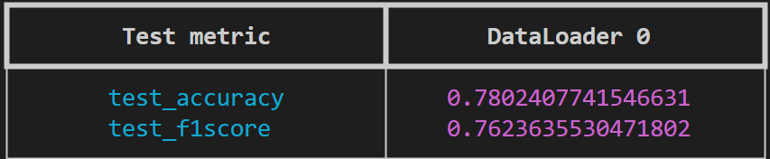
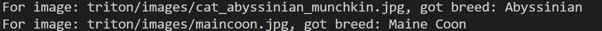
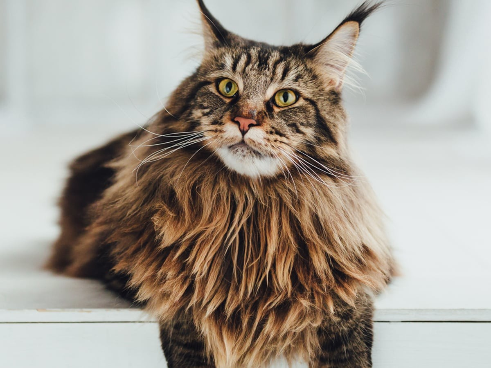
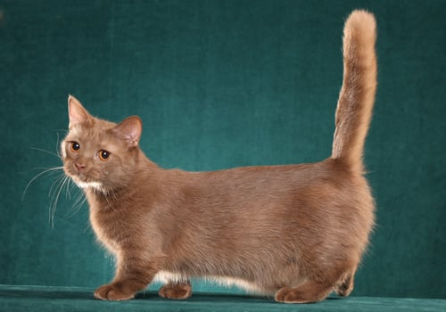

# CatBreedDetector

**Савчук Анна**

_В описании все ссылки привязаны к фразам для того, чтобы документ был
красивее. Если не видно ссылок, в конце этого документа на всякий случай они
все продублированы._

## Постановка задачи

Задача – на основе изображение предсказывать породу кошки. Рассматриваю этот
проект как учебный, чтобы больше поработать с моделями, работающими с
изображениями. За основу взят ноутбук с
[kaggle](https://www.kaggle.com/code/dima806/cat-breed-image-detection-vit/notebook).

### Формат входных и выходных данных

На вход подаётся изображение (в форматах jpeg, png), выход – название породы в
текстовом виде.

### Метрики

Метрики стандартные: Accuracy и F1-score (ожидаемые значения не меньше 0.75 для
обоих)

### Валидация

Для валидации набор данных буду делить в соотношении 80/20, для
воспроизводимости зафиксирую конкретный seed 83.

### Данные

Датасет - соединение данных по двум ссылкам из kaggle: _
[первая ссылка](https://www.kaggle.com/datasets/ma7555/cat-breeds-dataset), _
[вторая ссылка](https://www.kaggle.com/datasets/doctrinek/catbreedsrefined-7k).

Всего там 67 пород, предсказывать буду 50 наиболее распространённых.

Для тренировки (+ валидации) и тестирования данные делятся в соотношении 80/20,
далее данные для тренировки + валидации бьются в соотношении 80/20 для этапов
тренировки и валидации.

## Моделирование

### Бейзлайн

Простейшее решение – логистическая регрессия. Её можно обучить на признаках,
извлечённых из данных при помощи нейросетей.

### Основная модель

Модель основана на архитектуре Vision Transformer, привожу ссылку из
[ноутбука на huggingface](https://huggingface.co/google/vit-base-patch16-224-in21k).
Это будет обучение на приведённом ранее наборе данных.

### Внедрение

Интересно попробовать использовать модель как сервис, который будет запущен
рядом с основным кодом какого-либо приложения.

## Setup

Разработка проводилась на сервере с операционной системой Linux, GPU RTX 4090.
Для установки зависимостей использовался poetry, достаточная версия Python -
3.10. Для настройки и возможности повторить действия необходимо следующее:

- `git pull https://github.com/s-a-v-a-n-n-a/cat-breed-detector.git`
- `poetry install --no-root`
- `eval $(poetry env activate)`

## Train

Чтобы запустить тренировку, достаточно из корня репозитория выполнить команду

- `python3 cat_breed_detector/command.py train`

Запущенный процесс натренирует модель и сохранит полученную модель в директорию
`models`. На данный момент там лежит .dvc файл с примером модели. Все данные
распакуются из предоставленных dvc файлов автоматически.

При этом предполагается, что mlflow server уже поднят.

Для тестирования из корня репозитория нужно выполнить команду

- `python3 cat_breed_detector/command.py test --test_dir=<директория с моделями> --checkpoint_name=<имя файла чекпоинта в указанной ранее директории>`

Ниже привожу пример команды для примеров, прелставленных в репозитории:
`python3 cat_breed_detector/command.py test.py --test_dir=./models --checkpoint_name='model_val_loss=1.12.ckpt'`



dvc файлы при этом распакуются автоматически.

> Если необходимо скачать датасеты, запустите команды
>
> 1. `cd scripts`
> 2. `./download_dataset.sh`
> 3. `./download_dataset_refined.sh`

## Production preparation

Представлено три способа инференса модели: из чекпоинта, из _.onnx формата и из
_.trt.

- onnx: модель переводится в \*.onnx сразу после окончания тренировки. Имя
  итоговой модели подтягивается из конфигурационного файла. Для удобства в
  директории models представлена модель `model.onnx.dvc` в dvc.

- перевод из формата onnx в trt производится при помощи скрипта (запустите
  команду
  `./scripts/convert2tensor_rt.sh <путь до onnx модели от корня репозитория> <директория, в которую нужно поместить итоговую модель> <имя желаемой модели без расширения>`).
  Для удобства в директории models представлена модель `model.fp32.trt.dvc` в
  dvc. При этом необходимо учитывать, что пакет tensorrt на устройстве должен
  поддерживать версию 10.11.0.33 для успешного перевода. Чтобы можно было
  запускать скрипт с переводом в TensorRT, может быть полезно установить
  следующие пакеты:

  - `sudo apt-get update`
  - `sudo apt-get install nvidia-cuda-toolkit libboost-all-dev python3-dev build-essential`

## Infer

1. **Входные данные.**

На вход принимается директория с изображениями (форматы _.jpg, _.png), в
качестве примера можно использовать data/artifacts (содержатся в репозитории в
формате dvc, перед запуском примеров с data/artifacts.dvc ничего не нужно
делать). В случае, если скрипты не находят директорию, они попытаются её
достать из dvc.

2. **Запуск.**

   - Запуск инференса из чекпоинта:

     `python3 cat_breed_detector/command.py infer from_checkpoint --models_dir=models --checkpoint_name='model_val_loss=1.12.ckpt' --images_to_analyze='data/artifacts'`

   - Запуск инференса для модели в формате onnx:

     `python3 cat_breed_detector/command.py infer onnx --model_path=models/model.onnx --images_to_analyze='data/artifacts'`

   - Запуск инференса для модели в формате TensorRT:

     `python3 cat_breed_detector/command.py infer onnx --model_path=models/model.fp32.trt --images_to_analyze='data/artifacts'`

   - Запуск для Triton Server:

     - Чтобы локально развернуть сервер c моделью, выберите имя сети
       докер-контейнеру и запишите его в `.env` файл в переменную
       `NETWORK_NAME`.

     Пример:

     ```
     NETWORK_NAME=cat_breed_detector_triton
     ```

     Далее из корня репозитория запустите команду

     `dotenv -e <путь до Вашего .env файла> ./scripts/setup_triton_before_launch.sh <путь до модели в формате onnx> <версия модели> <путь до данных>`

     Тестовый пример на предоставленных данных:

     `dotenv -e .env ./scripts/setup_triton_before_launch.sh models/model.onnx 1 data/artifacts`

     Все данные из dvc распакуются сами.

     Здесь используется путь до onnx модели, так как на сервере, где
     проводилась разработка генерируется \*.trt модель другой версии
     сериализации. В Triton Server'е она понижена до 8.6.3.

     - Получение результатов:

     `python3 cat_breed_detector/command.py infer triton --url=<url triton сервера> --images_to_analyze=triton/images`

     - Чтобы опустить локальный Triton сервер, из корня репозитория запустите
       команду

     `dotenv -e <путь до Вашего .env файла> ./scripts/shut_down_triton.sh`

3. **Примеры.** Пример выхода для каждого из файлов в директории:



Сами котики:

|          Main Coon           |            Abyssinian / Manchkin            |
| :--------------------------: | :-----------------------------------------: |
|  |  |

# Ссылки

- Оригинальный ноутбук:

  - https://www.kaggle.com/code/dima806/cat-breed-image-detection-vit/notebook

- Данные:
  - https://www.kaggle.com/datasets/ma7555/cat-breeds-dataset
  - https://www.kaggle.com/datasets/doctrinek/catbreedsrefined-7k
